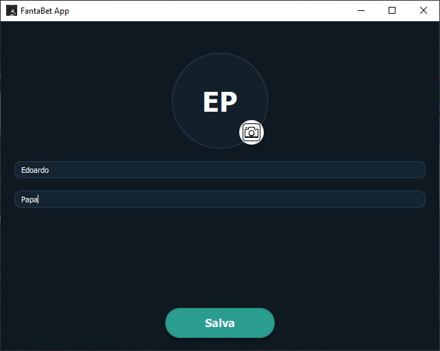

# FantaBet

<p align="center">
  
</p>

---

## 🇮🇹 Panoramica
FantaBet è un'app Qt pensata per gestire un'asta di fantacalcio (o qualsiasi altra
competizione basata su rilanci) con un'esperienza moderna: il *Master* controlla il
banco da desktop, mentre gli *Scommettitori* partecipano da tablet o notebook sulla
stessa rete inviando le puntate in tempo reale via UDP.

## 🇬🇧 Overview
FantaBet is a Qt-based app designed to manage a fantasy football auction (or any other
bidding-based competition) with a modern experience: the *Master* controls the auction
from desktop, while *Bidders* join from tablets or laptops on the same network, sending
their bids in real time via UDP.

---

## 🇮🇹 Funzionalità principali
- **Due modalità nello stesso eseguibile.** Master o Scommettitore selezionabili dalla home.
- **Waiting room del Master.** Scoperta in broadcast, avatar dinamici, passaggio all’asta.
- **Console d'asta completa.** Countdown, storico offerte, popup finale e animazioni.
- **Registrazione rapida dello scommettitore.** Nome, foto e invio automatico al Master.
- **Puntate personalizzabili.** Override da file `bets.json`.
- **Modelli C++ condivisi.** PlayerModel, PeopleModel, BidsModel come singleton QML.
- **Networking robusto via UDP.** Discovery, chunking, ACK/NACK, ID univoci.

## 🇬🇧 Key Features
- **Two modes in the same executable.** Master or Bidder selectable from the home screen.
- **Master’s waiting room.** Broadcast discovery, dynamic avatars, switch to auction view.
- **Full auction console.** Countdown, bid history, final popup, celebratory animations.
- **Quick bidder registration.** Name, photo, automatic send to Master.
- **Customizable bids.** Override with a `bets.json` file.
- **Shared C++ models.** PlayerModel, PeopleModel, BidsModel exposed as QML singletons.
- **Robust UDP networking.** Discovery, chunking, ACK/NACK, unique IDs.

---

## 🇮🇹 Architettura
- **Interfaccia utente:** QML/Qt Quick Controls 2 con componenti custom.
- **Strato C++:** modelli e servizi di rete registrati in `main.cpp`.
- **Dipendenze Qt:** Quick, Multimedia, Network.

## 🇬🇧 Architecture
- **User interface:** QML/Qt Quick Controls 2 with custom components.
- **C++ layer:** models and network services registered in `main.cpp`.
- **Qt dependencies:** Quick, Multimedia, Network.

---

## 🇮🇹 Flusso di utilizzo
<p align="center">
  
</p>

### Per il Master
<p align="center">
  
  
  
  <br/>
  
</p>

1. Avvia come *Master* e attendi la waiting room.  
2. Premi **Avanti**, scegli un giocatore, avvia il countdown.  
3. Gestisci con **Start/Pausa**, modifica i secondi col doppio clic, osserva lo storico.  
4. Alla chiusura popup con vincitore e possibilità di nuovo round.  

### Per gli Scommettitori
<p align="center">
  
  
</p>

1. Avvia come *Scommettitore*, inserisci nome/foto.  
2. Premi **Salva**: connessione automatica al Master.  
3. Scegli importo e invia il rilancio.  

---

## 🇬🇧 Usage Flow
<p align="center">
  
</p>

### For the Master
<p align="center">
  
  
  
  <br/>
  
</p>

1. Start as *Master* and wait in the waiting room.  
2. Press **Next**, choose a player, start the countdown.  
3. Manage with **Start/Pause**, adjust seconds via double click, check history.  
4. At the end, popup shows winner and lets you start a new round.  

### For the Bidders
<p align="center">
  
  
</p>

1. Start as *Bidder*, enter name/photo.  
2. Press **Save**: auto-connect to Master.  
3. Select bid amount and send instantly.  

---

## 🇮🇹 Compilazione e avvio
### Prerequisiti
- Qt 5.12+ con Quick, Quick Controls 2, Multimedia, Network.
- Compilatore C++ (MSVC, MinGW, Clang, GCC).

### Con Qt Creator
1. Apri `FantaBet.pro`.  
2. Configura un kit Qt 5.12+ e genera con *qmake* o *CMake*.  
3. Compila e avvia.  

### Da riga di comando
```bash
qmake FantaBet.pro
make
./FantaBet
```

---

## 🇬🇧 Build and Run
### Requirements
- Qt 5.12+ with Quick, Quick Controls 2, Multimedia, Network.
- C++ compiler (MSVC, MinGW, Clang, GCC).

### With Qt Creator
1. Open `FantaBet.pro`.  
2. Configure a Qt 5.12+ kit and generate with *qmake* or *CMake*.  
3. Build and run.  

### Command-line
```bash
qmake FantaBet.pro
make
./FantaBet
```

---

## 🇮🇹 Configurazione
- `bets.json` accanto all’eseguibile per valori personalizzati.  
- Modalità demo con puntate simulate.  

## 🇬🇧 Configuration
- `bets.json` next to executable for custom values.  
- Demo mode with simulated bids.  

---

## 🇮🇹 Note sul networking
1. Gli slave inviano `find` in broadcast finché non ricevono ACK.  
2. Dati anagrafici in chunk (~900B) con ritrasmissione.  
3. Ogni puntata firmata con ID e confermata via ACK.  

## 🇬🇧 Networking Notes
1. Slaves send `find` in broadcast until ACK is received.  
2. Personal data split into chunks (~900B) with retransmission.  
3. Each bid signed with ID and confirmed via ACK.  

---

**🇮🇹 Buon divertimento con le tue aste fantacalcistiche!**  
**🇬🇧 Enjoy your fantasy auction sessions!**
